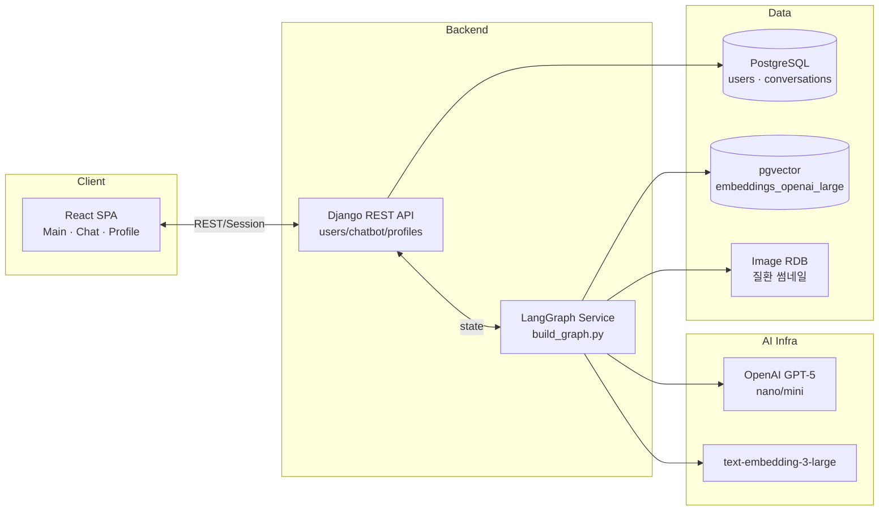
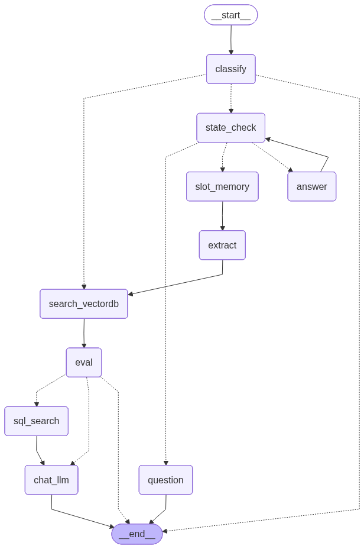

# MindCare ∞ | 정신건강 AI 상담 파트너

> 정신건강 정보 검색과 감정 코칭을 하나의 대화 경험으로 엮은 LangGraph 기반 하이브리드 챗봇 서비스

---

## 1. 서비스 한눈에
- **목표**: 국가정신건강정보포털 데이터를 기반으로 신뢰할 수 있는 질환 정보와 사용자의 감정 맥락을 동시에 케어하는 AI 파트너 제공
- **타깃**: 스스로 돌봄이 필요한 2030 직장인 · 취준생, 심리 상담이 부담스러운 초입 사용자
- **핵심 지표**: 상담 재방문율, 감정 키워드 다양성(=슬롯 충족률), FAQ 정답률

---

## 2. 우리가 해결하는 문제
| Pain Point | 기존 한계 | MindCare가 제시하는 해법 |
| --- | --- | --- |
| 감정 표현이 어려워 상담 시작 장벽이 높음 | 단순 QA 챗봇은 대화 맥락을 기억하지 못함 | **LangGraph 슬롯 메모리**로 7개 핵심 질문을 순차 채우며 공감형 대화 유지 |
| 정보 신뢰도에 대한 불안 | 출처가 불분명한 커뮤니티 답변 | **국가정신정보포털 → ETL → pgvector** 파이프라인으로 출처가 명확한 정보를 RAG로 제공 |
| 상담 내용 노출 우려 | Plain text 저장, 접근 제어 부재 | **Fernet 암호화 + 권한 기반 API**로 메시지를 저장, 게스트 모드로 익명 테스트 가능 |

---

## 3. 핵심 기능
### 3.1 AI 상담 경험
- **듀얼 플로우 LangGraph**: `classify → {information | counseling}`로 분기, 정보형은 Vector DB + SQL 이미지 검색, 상담형은 state machine으로 질문/답변 반복
- **Slot Memory & Thinking Process**: 증상·기간·강도·생활 영향 등 7개 슬롯을 채울 때까지 `state_check → question → answer` 루프, 진행 상태를 메시지에 thinking log로 저장
- **자연어 후처리**: `chat_llm_node`에서 pgvector 검색 결과와 SQL 질환 이미지를 결합해 정리된 답변/추천 루틴 제시

### 3.2 사용자 경험
- **메인 인사 & 타입라이터**: 로그인 정보 기반 맞춤 인사, `Sphere2D` 컴포넌트로 편안한 시각 효과 제공
- **대화 사이드바**: 검색, 감정 퍼센트 바, 자동 제목 생성, 게스트 안내 등 발표 시 narrative 강조 포인트
- **실시간 제어**: 답변 중단(Stop), 새 상담(New Counseling), 특정 대화 선택 기능으로 실제 상담 흐름 시연 가능

### 3.3 데이터 인사이트 & 보안
- **프로필 대시보드**: KPI(총 대화·메시지), 최근 7일 추이, 시간대 히트맵, 감정 분포, 키워드 클라우드, 질환 TOP10을 SVG 차트로 제공
- **파일 업로드 & 계정 제어**: 프로필 이미지 업로드, 비밀번호 변경, 계정 삭제를 React Form으로 지원
- **Fernet 암호화**: `apps/chatbot/encryption.py`에서 대화 내용을 저장 전 자동 암호화 → `get_decrypted_content()`로만 접근

---

## 4. 서비스 흐름 (데모 시나리오)
1. **온보딩**: 메인 페이지에서 게스트/회원 구분 메시지 확인 → Sidebar 토글로 저장 정책 설명
2. **정보형 데모**: "우울증이란?" 질문 → LangGraph가 Vector DB + 이미지 검색 → 출처가 포함된 답변과 관련 이미지 카드 확인
3. **상담형 데모**: "요즘 잠이 안 와요" 입력 → Bot이 7가지 추가 질문으로 감정 슬롯 채움 → thinking indicator & 상태 메시지 강조
4. **분석 대시보드**: Profile → Dashboard 이동, 방금 대화 후 KPI/차트 자동 갱신 확인
5. **보안 기능**: 로그아웃/게스트 모드에서도 메시지 저장 안 됨을 강조, 관리자 페이지 또는 암호화 로직 언급

---

## 5. 시스템 아키텍처


---

## 6. LangGraph + RAG 파이프라인
1. **분류(Classify Node)**: `gpt-5-nano`가 질문을 `information / counseling / unknown`으로 판단  
2. **정보형 플로우**  
   - `search_vectordb_node`: pgvector(`text-embedding-3-large`)에서 top-k chunk 검색  
   - `eval_node`: `gpt-5-mini`가 근거 적합성 평가 → 부족 시 `sql_search_node`로 질환 이미지·FAQ 보강  
   - `chat_llm_node`: 근거+이미지+사용자 맥락을 바탕으로 최종 응답 생성
3. **상담형 플로우**  
   - `state_check_node`: 슬롯 충족 여부 확인, 미충족 시 `question_node`, 사용자 응답은 `answer_node`에서 저장  
   - `slot_memory_node`: 수집된 감정 정보 요약 → `extract_node`에서 증상 키워드 추출 후 RAG 경로 재사용  
4. **Thinking Log & Resume**: 각 메시지에 `thinking_process` JSON을 저장해 추후 시각화/재개 가능

---

## 7. 상담형 대화 처리 방식

### 7.1 상태 관리 아키텍처
상담형 대화는 **DB 저장**과 **메모리 상태**를 분리해서 관리합니다:
- **DB 저장**: 사용자/봇 메시지 내용만 암호화하여 `Message` 테이블에 저장
- **메모리 상태**: `conversation_state`는 프론트엔드가 들고 있다가 다음 요청 시 백엔드로 전달

**conversation_state 구조** (상담형 질문 진행 중):
```python
{
    "slot_data": {                    # 수집된 슬롯 데이터
        "slot_1": "우울하고 무기력해요",  # 감정 상태
        "slot_2": "2주 전부터",           # 상황 및 시기
        "slot_3": None,                  # 신체적 변화 (아직 수집 안 됨)
        "slot_4": None,                  # 사고 패턴
        "slot_5": None,                  # 행동 패턴
        "slot_6": None,                  # 대인관계
        "slot_7": None                   # 전문 상담 의향
    },
    "slot_status": {                  # 각 슬롯 완료 여부
        "slot_1": True,               # 감정 상태 수집 완료
        "slot_2": True,               # 상황 및 시기 수집 완료
        "slot_3": False,              # 신체적 변화 미수집
        "slot_4": False,
        "slot_5": False,
        "slot_6": False,
        "slot_7": False
    },
    "current_slot": "slot_3",         # 현재 질문 중인 슬롯 (신체적 변화)
    "initial_question": "요즘 우울해요", # 최초 질문 (계속 유지)
    "question_type": "counseling"     # 질문 타입
}
```

### 7.2 질문-답변 루프 흐름

#### 🔄 Turn 1: 첫 질문

**📥 프론트 → 백엔드**
| 항목 | 값 |
|------|-----|
| 사용자 입력 | "요즘 우울해요" |
| conversation_state | `null` (처음이니까) |
| is_answer | `false` |

**⚙️ 백엔드 처리**
1. **그래프 실행**: classify → state_check → question → END
2. **정보 추출**: LLM이 "요즘 우울해요"에서 감정 상태(slot_1) 추출
3. **질문 생성**: LLM이 다음 슬롯(slot_2)에 대한 질문 생성
4. **상태 구성**: 수집된 정보를 conversation_state로 정리

**📤 백엔드 → 프론트**
| 항목 | 값 | 설명 |
|------|-----|------|
| **bot_question** | "언제부터 우울하셨나요?" | 화면에 표시할 봇 질문 |
| **requires_answer** | `true` | 사용자 답변 필요 플래그 |
| **conversation_state** | 👇 아래 참조 | 다음 요청 시 필요한 상태 |

**conversation_state 상세:**
```
📦 slot_data (수집된 답변)
  ✓ slot_1: "요즘 우울해요" (감정 상태)
  ⏳ slot_2~7: 아직 수집 안 됨

📊 slot_status (완료 여부)
  ✓ slot_1: 완료
  ⏳ slot_2~7: 미완료

🎯 current_slot: "slot_2" (다음 질문 대상)
📝 initial_question: "요즘 우울해요" (최초 질문 보관)
🏷️ question_type: "counseling"
```

**💾 프론트엔드 메모리 저장**
- `conversationState` ← conversation_state 저장
- `requiresAnswer` ← true 저장
- 화면에 봇 질문 표시

---

#### 🔄 Turn 2: 사용자 답변

**📥 프론트 → 백엔드**
| 항목 | 값 |
|------|-----|
| 사용자 입력 | "2주 전부터요" |
| conversation_state | Turn 1에서 받은 상태 (메모리에서 가져옴) |
| is_answer | `true` (requiresAnswer 값 사용) |

**⚙️ 백엔드 처리**
1. **상태 복원**: conversation_state로 이전 대화 상태 복원
2. **그래프 실행**: classify (스킵) → state_check → answer → state_check → question → END
3. **답변 저장**: "2주 전부터요"를 slot_2에 저장
4. **다음 슬롯**: slot_3 (신체적 변화) 찾기
5. **질문 생성**: LLM이 slot_3에 대한 질문 생성

**📤 백엔드 → 프론트**
| 항목 | 값 | 설명 |
|------|-----|------|
| **bot_question** | "수면은 어떠신가요?" | 다음 질문 |
| **requires_answer** | `true` | 계속 답변 필요 |
| **conversation_state** | 👇 아래 참조 | 업데이트된 상태 |

**conversation_state 상세:**
```
📦 slot_data (수집된 답변)
  ✓ slot_1: "요즘 우울해요" (감정 상태)
  ✓ slot_2: "2주 전부터요" (상황 및 시기) ← 새로 추가!
  ⏳ slot_3~7: 아직 수집 안 됨

📊 slot_status (완료 여부)
  ✓ slot_1, slot_2: 완료
  ⏳ slot_3~7: 미완료

🎯 current_slot: "slot_3" (다음 질문 대상)
📝 initial_question: "요즘 우울해요" (계속 유지)
🏷️ question_type: "counseling"
```

**💾 프론트엔드 메모리 업데이트**
- `conversationState` ← 업데이트된 상태 저장
- `requiresAnswer` ← true 유지
- 화면에 다음 질문 표시

---

#### 🔁 Turn 3~7: 반복

위 과정이 **7개 슬롯이 모두 채워질 때까지** 반복됩니다.

각 턴마다:
- 프론트: 사용자 답변 + conversation_state 전송
- 백엔드: 답변 저장 → 다음 슬롯 찾기 → 질문 생성
- 프론트: 질문 표시 + 상태 업데이트

---

#### ✅ 최종 턴: 모든 슬롯 완료

**📥 프론트 → 백엔드**
| 항목 | 값 |
|------|-----|
| 사용자 입력 | "네, 받고 싶어요" (마지막 답변) |
| conversation_state | 6개 슬롯 완료된 상태 |
| is_answer | `true` |

**⚙️ 백엔드 처리**
1. **상태 복원**: 6개 슬롯 완료 상태 복원
2. **그래프 실행**: classify → state_check → answer → state_check → slot_memory → extract → search_vectordb → eval → chat_llm → END
3. **정보 통합**: 7개 슬롯 데이터 요약
4. **증상 추출**: 키워드 추출 (우울, 불면, 무기력 등)
5. **정보 검색**: 관련 질환 정보 검색
6. **최종 답변**: 종합 분석 결과 생성

**📤 백엔드 → 프론트**
| 항목 | 값 | 설명 |
|------|-----|------|
| **final_answer** | "당신의 증상을 분석한 결과..." | 최종 상담 결과 |
| **requires_answer** | `false` | 답변 불필요 (상담 종료) |
| **related_images** | [...] | 관련 질환 이미지 |

**💾 프론트엔드 상태 초기화**
- `conversationState` ← `null` (상담 종료)
- `requiresAnswer` ← `false` (새 질문 모드)
- 화면에 최종 답변 표시

---

### 7.2.1 핵심 데이터 흐름 요약

```
┌─────────────┐                    ┌─────────────┐
│  프론트엔드  │                    │   백엔드    │
└─────────────┘                    └─────────────┘
       │                                   │
       │  ① 사용자 입력 + 상태             │
       │─────────────────────────────────>│
       │                                   │
       │                          ② 그래프 실행
       │                             (정보 추출,
       │                              질문 생성)
       │                                   │
       │  ③ 봇 질문 + 업데이트된 상태      │
       │<─────────────────────────────────│
       │                                   │
  ④ 메모리 저장                            │
  (conversationState,                     │
   requiresAnswer)                        │
       │                                   │
  ⏳ 사용자 답변 대기                       │
       │                                   │
       │  ⑤ 답변 + 저장된 상태             │
       │─────────────────────────────────>│
       │                                   │
       │                          ⑥ 상태 복원,
       │                             답변 저장,
       │                             다음 질문
       │                                   │
       │  ⑦ 다음 질문 + 업데이트된 상태    │
       │<─────────────────────────────────│
       │                                   │
       └───────────── 반복 ─────────────────┘
```

**핵심 포인트:**
- 백엔드는 상태를 저장하지 않음 (stateless)
- 프론트엔드가 `conversation_state`를 메모리에 보관
- 매 요청마다 프론트가 상태를 백엔드로 전송
- 백엔드는 받은 상태로 그래프를 재실행

### 7.3 핵심 메커니즘
- **한 턴 = LangGraph 한 번 실행**: `question` 노드가 추가 질문을 만들면 그래프는 `END`에서 멈추고, 서버는 `conversation_state`와 `requires_answer=true`를 프론트로 전달해 사용자 입력을 기다립니다.
- **상태 복원**: 프론트가 다음 메시지 전송 시 `conversation_state`와 `is_answer=true`를 함께 보내면, 백엔드는 `initial_state.update(conversation_state)`로 이전 상태를 복원한 뒤 그래프를 재실행합니다.
- **classify 최적화**: 두 번째 호출부터는 `question_type`이 이미 설정되어 있어 LLM 분류를 스킵하고 바로 `state_check`로 라우팅됩니다.
- **슬롯 완료 후 전환**: 7개 슬롯이 모두 채워지면 `slot_memory → extract → search_vectordb → eval → chat_llm` 순으로 자동 전환되어 정보형 플로우와 동일한 방식으로 최종 답변을 생성합니다.
- **requires_answer 판단**: `question` 노드는 `bot_question`만 생성하고, views.py가 `bot_question` 유무를 보고 `requires_answer` 플래그를 설정합니다.

**requires_answer 설정 로직** (views.py):
```python
# run_langgraph 실행 후
if bot_question:
    # question 노드가 질문 생성함
    return Response({
        'bot_question': bot_question,
        'conversation_state': updated_state,
        'requires_answer': True,  # 답변 필요
    })
else:
    # chat_llm 노드가 최종 답변 생성함
    return Response({
        'requires_answer': False,  # 답변 불필요
    })
```

### 7.4 상담형 이어가기 vs 새 질문 구분
프론트엔드는 `requiresAnswer` 상태로 자동 구분합니다:

**프론트엔드 상태 관리** (ChatPage.js):
```javascript
const [conversationState, setConversationState] = useState(null);
const [requiresAnswer, setRequiresAnswer] = useState(false);

// 메시지 전송 시
const isAnswerMode = requiresAnswer;  // 현재 상태 사용
const statePayload = conversationState;

await sendMessage(conversationId, content, statePayload, isAnswerMode);

// 응답 처리
setConversationState(data?.conversation_state || null);  // 상태 저장
setRequiresAnswer(!!data?.requires_answer);              // 플래그 업데이트
```

**동작 시나리오**:
```
[상담형 이어가기]
1. 봇: "언제부터 아프셨나요?" + requires_answer=true
   → setRequiresAnswer(true), setConversationState({...})
2. 사용자: "어제부터요"
   → isAnswerMode=true (requiresAnswer가 true니까)
   → 백엔드에 is_answer=true, conversation_state={...} 전달
   → 이전 상담 이어서 진행

[새 질문 시작]
1. 봇: 최종 답변 + requires_answer=false
   → setRequiresAnswer(false), setConversationState(null)
2. 사용자: "우울증이란?"
   → isAnswerMode=false (requiresAnswer가 false니까)
   → 백엔드에 is_answer=false, conversation_state=null 전달
   → 새 질문으로 처리
```

**핵심**: 백엔드가 `requires_answer` 플래그로 프론트 상태를 제어하므로, 프론트는 현재 상태만 전달하면 자동으로 구분됩니다.

### 7.5 왜 이렇게 설계했나?
LangGraph는 동기적으로 실행되는 구조라 사용자 대기 시간을 처리할 수 없습니다. 따라서:
- 질문 생성 시점에 그래프를 `END`로 종료
- 프론트-백엔드가 `conversation_state`를 주고받으며 "질문-대기-응답" 루프 구현
- DB에는 메시지만 저장하고, 휘발성 대화 상태는 메모리에서 관리해 성능과 보안 최적화



---

## 8. 데이터 수집 & ETL
| 단계 | 설명 | 커맨드 |
| --- | --- | --- |
| Extraction | 국가정신정보포털 질환 정보 · FAQ 크롤링, 일러스트 필터링 | `python -m rag.services.etl.extract.extract_cli` |
| Transform | LangChain splitter로 chunking, 카테고리 라벨링, 이미지 메타 생성 | `python -m rag.services.etl.transform.transform_cli` |
| Load (RDB) | 질환 이미지/메타를 PostgreSQL에 적재 | `python -m rag.services.etl.loader.load_rdb` |
| Load (Vector) | `text-embedding-3-large` 임베딩 생성 후 pgvector 테이블 저장 | `python -m rag.services.etl.loader.load_vectordb` |

---

## 9. 기술 스택
| 영역 | 기술 |
| --- | --- |
| Frontend | React 18, React Router, Framer Motion, SVG 기반 커스텀 차트 |
| Backend | Django 5, Django REST Framework, PostgreSQL, Redis(세션), AWS S3(or Media URL) |
| AI / Data | LangGraph, OpenAI GPT-5 nano/mini, text-embedding-3-large, pgvector |
| Infra & Tools | Docker Compose(PostgreSQL), Playwright(크롤러), uv 패키지 매니저 |
| 보안 | Django 세션 인증, Fernet 암호화, CORS/CSRF 설정, 게스트 모드 분기 |

---

## 10. 로컬 실행 요약
1. **환경 변수**  
   ```bash
   cp .env.sample .env
   cp frontend/.env.sample frontend/.env
   # PORT, PG_PORT, OPENAI_API_KEY, ENCRYPTION_KEY 등 설정
   ```
2. **의존성 & DB**  
   ```bash
   uv venv .venv python3.12
   source .venv/bin/activate  # 또는 .venv\\Scripts\\activate
   uv pip install -r docker/requirements.txt
   docker-compose up -d  # PostgreSQL
   ```
3. **마이그레이션 & 슈퍼유저**  
   ```bash
   python backend/manage.py makemigrations
   python backend/manage.py migrate
   python backend/manage.py createsuperuser
   ```
4. **서버 실행**  
   ```bash
   # backend
   python backend/manage.py runserver 0.0.0.0:8000
   # frontend
   cd frontend && npm install && npm start
   ```
5. **RAG 리소스 준비(선택)**: ETL 3단계를 순차 실행 후 `python rag/build_graph.py`로 그래프 검증
